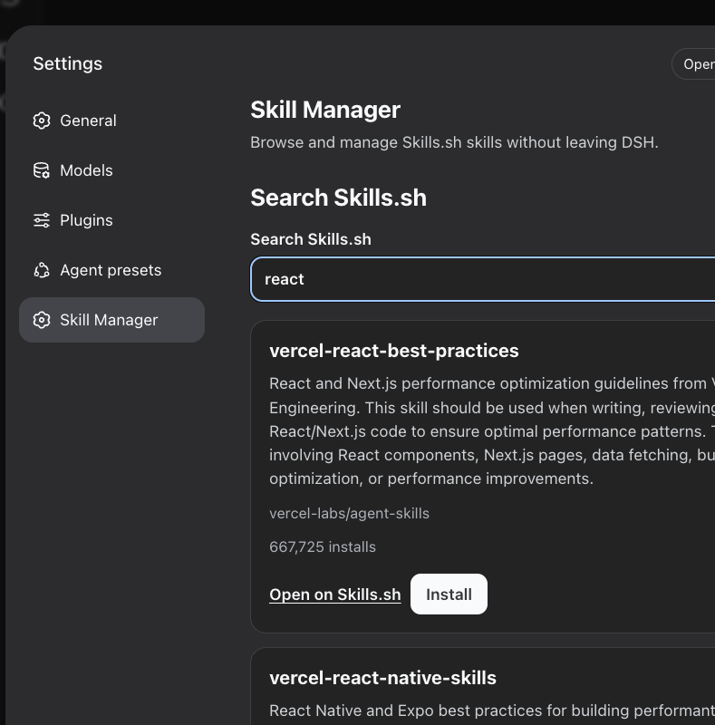

# DSH Skill Manager

Install the public `v0.1.0` release into the DSH Web profile:

```bash
dsh plugin --profile web add github:changxuanfan/noumena_gpt#v0.1.0
```

Restart `dsh web`, then open **Settings → Skill Manager**.



DSH Skill Manager is a bilingual DeepSeek Harness plugin for discovering
Skills.sh skills and safely managing the local copies that the plugin owns.

## Requirements

- DeepSeek Harness `0.1.1-rc.2`
- Node.js `^22.19.0` or `>=24.0.0`
- `pnpm` available to `dsh plugin`
- A loopback DSH Web session for installation, update, and removal

Search works through the DSH Host. Filesystem mutations are intentionally
disabled for non-loopback browsers.

## Features

- Search Skills.sh by keyword.
- Show name, description, source, install count, and canonical Skills.sh link.
- Confirm and install a validated skill into `$DSH_HOME/skills`.
- List only the local skills owned by this plugin.
- Detect current, locally modified, missing, and invalid local states.
- Check for upstream updates and distinguish an unavailable source from a
  retryable network failure.
- Confirm updates, warn before overwriting local changes, and roll back failed
  replacements.
- Confirm removal, warn about local changes, and restore the skill if manifest
  commit fails.
- Follow DSH's active English or Chinese locale and light or dark theme.

## Use

### Search and install

1. Open **Settings → Skill Manager**.
2. Enter a keyword such as `react`, `testing`, or `debugging`.
3. Inspect the result metadata and open its Skills.sh page if desired.
4. Select **Install**.
5. Review the confirmation and approve the operation.

The plugin downloads from Skills.sh, validates the complete snapshot, and
writes the skill as:

```text
$DSH_HOME/skills/<skill-name>/SKILL.md
```

DSH's filesystem skill provider watches this root and discovers the new skill.

### Check and apply updates

Select **Check for updates** on a Managed Skill.

- **Current** means the installed remote hash matches Skills.sh.
- **Locally modified** means files changed after installation.
- **Source unavailable** means Skills.sh authoritatively returned a missing
  source; the local copy is preserved.
- Network and response failures remain retryable errors.

An available update must be confirmed. A prepared update is rejected if the
manifest or local files change before confirmation.

### Uninstall

Select **Uninstall**, review the state warning, and confirm. Only a skill
recorded in the ownership manifest can be removed.

## Safety model

Skills.sh responses and skill contents are untrusted input.

- All online catalog and snapshot data comes from `https://skills.sh`.
- Redirects are rejected, response bodies are bounded, and response shapes are
  validated.
- Skill names must satisfy DSH's kebab-case contract.
- Absolute paths, traversal, backslashes, control characters, duplicate
  case-normalized paths, excessive depth, excessive entries, and oversized
  content are rejected.
- Snapshot text must round-trip through UTF-8 without loss.
- The Skills Root, manager state, staging, backup, and target directories are
  checked as physical non-symlink directories.
- Every write, staging copy, recovery backup, manifest, update, and deletion
  stays beneath `$DSH_HOME/skills`.
- User-owned directories absent from the manifest are never overwritten,
  updated, or removed.
- Installation, updates, and removal share one mutation lock.
- Confirmations use expiring capacity-bounded in-memory tokens tied to the
  state the user reviewed.
- Targets are atomically frozen or claimed before manifest commit; rollback
  preserves the previously usable state.

Plugin state lives at:

```text
$DSH_HOME/skills/.dsh-skill-manager/
├── manifest.json
├── staging/
└── backups/
```

## Development

```bash
npm ci
npm run typecheck
npm test
npm run build
npm run check
npm pack --dry-run
```

`npm run check` runs type checking, all automated tests, rebuilds the committed
Host and client artifacts, and fails if generated artifacts differ from the
repository.

### Real DSH smoke test

Start a clean DSH Web profile on port `39177`, then run:

```bash
npm run smoke
```

Override the target when needed:

```bash
DSH_SKILL_MANAGER_URL=http://127.0.0.1:8080 npm run smoke
```

The smoke test checks Host health, real Skills.sh search, confirmed install,
managed inventory, update checking, confirmed removal, and final cleanup.

## Architecture

- The Cordis Host plugin owns Skills.sh access and all filesystem operations.
- The Web client registers an independent `settings.section` and communicates
  only with same-origin Host endpoints.
- The ownership manifest separates Managed Skills from user-owned local skills.
- The Skills.sh adapter isolates its currently public API from the rest of the
  plugin.

The project specification and decisions are in [`docs/`](docs/). Work was
delivered through GitHub Issues and pull requests with acceptance criteria,
test evidence, and dependency links.

## AI development disclosure

This assignment was developed throughout with **GitHub Copilot CLI runtime in
VS Code** using **GPT-5.4**.

AI-assisted work included public API research, design synthesis, issue and PR
creation, test-first implementation, security review, browser automation,
documentation, and release verification.

Key human decisions recorded in the repository include:

- keeping the GitHub repository name `noumena_gpt` while using
  `dsh-skill-manager` as the package and plugin identity;
- making `$DSH_HOME/skills` the hard write boundary;
- refusing to take ownership of existing user-managed directories;
- using a validated Skills.sh HTTP adapter instead of parsing CLI output;
- shipping prebuilt runtime artifacts so GitHub installation does not require
  an unsafe package-build allowlist;
- restricting mutations to loopback same-origin Web clients.

## Known limitations

- DSH is currently an RC project and its extension APIs may change.
- The Skills.sh endpoints used by the official Skills CLI do not publish a
  long-term compatibility guarantee.
- v0.1.0 manages the DSH user Skills Root only, not project-scoped roots.
- Operations are per skill; bulk installation and bulk updates are out of
  scope.
- The plugin validates package structure and paths but does not endorse the
  instructional content of third-party skills.

## License

[MIT](LICENSE)
